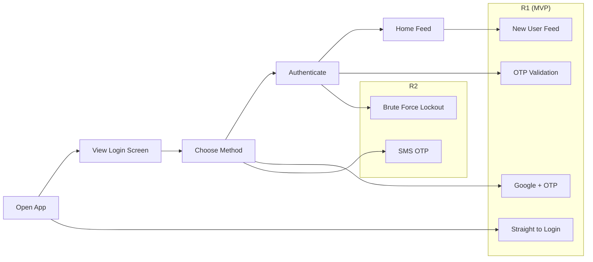

# User Story Mapping Skill for Claude

A Claude skill for collaborative user story mapping based on [Jeff Patton's methodology](https://www.jpattonassociates.com/story-mapping/). Helps product teams break down requirements into structured, visual story maps with release planning.

## What It Does

Drop `SKILL.md` into your Claude skills directory and Claude becomes a story mapping facilitator — running workshops, generating maps from requirements, and exporting to your tools.

### Two Modes

**Coaching Mode** — Claude walks you through the process like a workshop facilitator. One question at a time, validates each layer before going deeper, periodically shows the evolving map.

**Generation Mode** — Give Claude a raw requirement. It asks 3-5 targeted questions, then generates a complete story map with release groupings.

### Three Output Formats

| Format | When |
|--------|------|
| ASCII visual map | Default — works everywhere |
| Structured Markdown | Full detail: user stories, acceptance criteria, tasks, risks |
| Mermaid diagram | Always available — great for GitHub, Notion, Miro |

### Integrations (via MCP)

When you have the relevant MCP configured, Claude can export directly to:

| Tool | What it creates | MCP |
|------|----------------|-----|
| **Figma / FigJam** | Board with activity frames and story stickies | [Figma-Context-MCP](https://github.com/GLips/Figma-Context-MCP) |
| **Miro** | Board with activity cards and story stickies | [mcp-miro](https://github.com/k-jarzyna/mcp-miro) |
| **Jira** | Epics + Issues + Sub-tasks + Labels | [mcp-atlassian](https://github.com/sooperset/mcp-atlassian) |
| **Linear** | Issues + Sub-issues + Labels + Cycles | [linear-mcp-server](https://github.com/jerhadf/linear-mcp-server) |

If an MCP isn't configured, Claude says so, links to the setup guide, and offers a Mermaid or markdown fallback.

---

## Installation

### Claude Code

```bash
mkdir -p ~/.claude/skills/user-story-mapping
cp SKILL.md ~/.claude/skills/user-story-mapping/SKILL.md
```

### Other Claude environments

Check your platform's documentation for where to place skill files.

---

## Usage

### Coaching Mode
```
Use the user story mapping skill in coaching mode.
I want to map out [feature/product].
```

### Generation Mode
```
Use the user story mapping skill in generation mode.
Here's my requirement: [paste requirement]
```

### Mermaid Output
```
Give me the current map as a Mermaid diagram.
```

### Export to Jira / Linear / Figma / Miro
```
Export this story map to Jira.
Create Linear issues from this map.
Export to Miro.
```

---

## Output Examples

### ASCII Visual Map

```
USER STORY MAP: User Login
Persona: Finnish Consumer (buyer/seller)

BACKBONE (User Journey)
═════════════════════════════════════════════════════════════════════════════

┌─────────────┐  ┌─────────────┐  ┌─────────────┐  ┌─────────────┐  ┌─────────────┐
│  1. Open    │  │  2. View    │  │  3. Choose  │  │  4. Authen- │  │  5. Home    │
│     App     │  │   Login     │  │   Method    │  │   ticate    │  │    Feed     │
└──────┬──────┘  └──────┬──────┘  └──────┬──────┘  └──────┬──────┘  └──────┬──────┘
       │                │                │                │                │
───────┼────────────────┼────────────────┼────────────────┼────────────────┼─── R1 (MVP)
       │                │                │                │                │
  ┌────┴────┐      ┌────┴────┐      ┌────┴────┐      ┌────┴────┐      ┌────┴────┐
  │Straight │      │Google + │      │Google   │      │OTP: 10m │      │New user │
  │to login │      │OTP email│      │OAuth    │      │3 attempt│      │feed     │
  └─────────┘      └─────────┘      └─────────┘      └─────────┘      └─────────┘
```

### Mermaid Diagram



### Jira Export Mapping

| Story Map | Jira |
|-----------|------|
| Backbone activity | Epic |
| Story | Issue (under Epic) |
| Acceptance criteria | Issue description (Given/When/Then) |
| Tasks | Sub-tasks |
| Risks | Labels |
| Release group | Sprint or Fix Version |

---

## Example Maps

- [`user-login-story-map.md`](user-login-story-map.md) — User login flow for a Finnish sports gear marketplace (generated in coaching mode)
- [`add-item-to-cart-story-map.md`](add-item-to-cart-story-map.md) — Add to cart for an e-commerce app (generated in generation mode)

---

## Contributing

PRs welcome — especially for:
- New MCP integrations
- Additional output formats
- Improved coaching prompts
