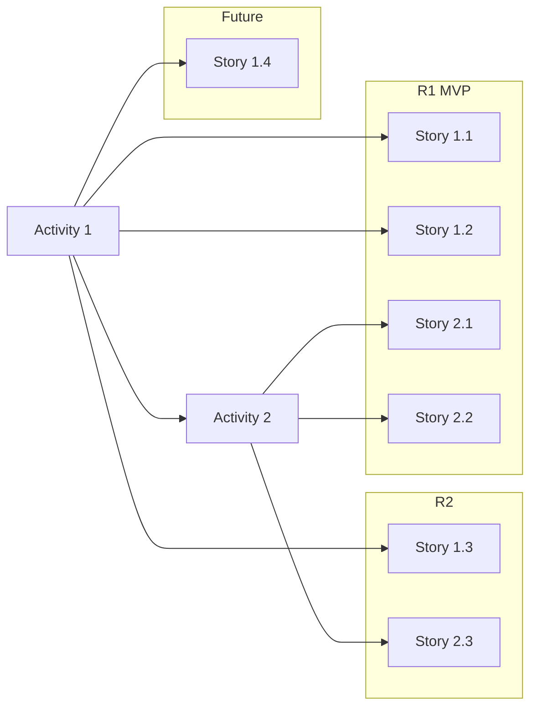

# User Story Mapping Skill

## Overview
A Claude skill for collaborative user story mapping based on Jeff Patton's methodology. Helps product teams break down requirements into structured, visual story maps with release planning — usable both as a team facilitation tool and as structured AI context.

---

## Two Modes

### Mode 1: Coaching Mode (Guided Workshop)
Walk the user step-by-step through story mapping, like a facilitator running a workshop.

**Flow:**
1. **Identify the user persona(s)** — Who is the primary user? Any secondary personas?
2. **Define the backbone (happy path)** — Ask the user to describe the high-level steps end to end. Aim for 3-7 steps.
3. **Go vertical on each step** — For each backbone step, ask deeper questions about requirements, tasks, and acceptance criteria.
4. **Go horizontal** — Expand to edge cases, error states, alternative flows.
5. **Add metadata** — Capture comments, tasks, risks per story.
6. **Define releases** — Group stories into MVP / R1 / R2 / Future.
7. **Generate output** — Produce the ASCII visual map and structured markdown.

**Coaching behavior for Claude:**
- Ask one question at a time. Don't overwhelm.
- Confirm each level before going deeper.
- Summarize back what you heard before moving on.
- Challenge assumptions: "What happens if the user does X instead?"
- Always think from the user's perspective, not the system's.
- Periodically show the evolving ASCII map so the user can see progress.

---

### Mode 2: Generation Mode (Fast Breakdown)
User provides a raw requirement or product idea. Claude asks targeted clarifying questions, then generates a complete story map.

**Flow:**
1. User provides the requirement/product idea.
2. Claude asks 3-5 clarifying questions about:
   - Target user(s)
   - Core happy path
   - Known constraints or requirements
   - Priority / what's most important for first release
3. Claude generates the full story map with suggested releases.
4. User reviews and iterates.

---

## Output Format

### Part 1: ASCII Visual Map

The backbone runs horizontally across the top. Stories hang vertically below each activity. Release lines cut horizontally across the map.

```
USER STORY MAP: [Product/Feature Name]
Persona: [Primary User]

BACKBONE (User Journey)
═════════════════════════════════════════════════════════════════════════════

┌─────────────┐    ┌─────────────┐    ┌─────────────┐    ┌─────────────┐
│  Activity 1 │    │  Activity 2 │    │  Activity 3 │    │  Activity 4 │
│  (Step Name)│    │  (Step Name)│    │  (Step Name)│    │  (Step Name)│
└──────┬──────┘    └──────┬──────┘    └──────┬──────┘    └──────┬──────┘
       │                  │                  │                  │
───────┼──────────────────┼──────────────────┼──────────────────┼───── R1 (MVP)
       │                  │                  │                  │
  ┌────┴────┐        ┌────┴────┐        ┌────┴────┐        ┌────┴────┐
  │Story 1.1│        │Story 2.1│        │Story 3.1│        │Story 4.1│
  │ ⚠️ risk  │        │         │        │ 📝 task │        │         │
  └─────────┘        └─────────┘        └─────────┘        └─────────┘
  ┌─────────┐        ┌─────────┐        ┌─────────┐
  │Story 1.2│        │Story 2.2│        │Story 3.2│
  │ 💬 note │        │         │        │         │
  └─────────┘        └─────────┘        └─────────┘
       │                  │
───────┼──────────────────┼──────────────────────────────────────────── R2
       │                  │
  ┌────┴────┐        ┌────┴────┐
  │Story 1.3│        │Story 2.3│
  └─────────┘        └─────────┘
       │
───────┼────────────────────────────────────────────────────────────── Future
       │
  ┌────┴────┐
  │Story 1.4│
  └─────────┘

Legend: 💬 Comment  📝 Task  ⚠️ Risk
```

---

### Part 2: Structured Markdown Detail

## Story Map: [Product/Feature Name]

### Persona
**Primary:** [Name/Role] — [Brief description of who they are and what they need]
**Secondary:** [If applicable]

---

### Backbone

#### Activity 1: [Step Name]
> High-level description of what the user is doing at this stage.

##### Release 1 (MVP)

**Story 1.1: [Short Title]**
- **User Story:** As a [user], I want [X] because [Y]
- **Acceptance Criteria:**
  - [ ] Given [context], when [action], then [outcome]
  - [ ] Given [context], when [action], then [outcome]
- **Tasks:**
  - [ ] [Development task]
  - [ ] [Design task]
- **Comments:** [Notes from discussions, decisions made, open questions]
- **Risks:** [Technical, business, or UX risks to be aware of]

**Story 1.2: [Short Title]**
- **User Story:** As a [user], I want [X] because [Y]
- **Acceptance Criteria:**
  - [ ] ...
- **Tasks:** ...
- **Comments:** ...
- **Risks:** ...

##### Release 2

**Story 1.3: [Short Title]**
- ...

---

#### Activity 2: [Step Name]
> High-level description...

[...continue for each activity...]

---

### Release Summary

| Release | Scope | Stories | Goal |
|---------|-------|---------|------|
| R1 (MVP) | Core happy path | 1.1, 1.2, 2.1, 2.2, 3.1, 4.1 | [What user can do after R1] |
| R2 | Enhanced features | 1.3, 2.3, 3.2, 3.3 | [What R2 adds] |
| Future | Nice-to-haves | 1.4 | [Vision items] |

---

### Open Risks

| ID | Story | Risk | Severity | Status |
|----|-------|------|----------|--------|
| R1 | 1.1 | [Risk description] | High/Med/Low | Open/Resolved |

### Open Tasks

| ID | Story | Task | Owner | Status |
|----|-------|------|-------|--------|
| T1 | 2.1 | [Task description] | [Who] | Todo/In Progress/Done |

---

### Part 3: Mermaid Diagram (available in both Coaching and Generation modes)

An alternative to the ASCII map. Use `graph LR` (left-to-right) to mirror story map reading direction.

- Backbone activities → top-level nodes (outside all subgraphs)
- Stories → child nodes, grouped by release
- Release groupings → `subgraph` blocks
- **Node labels:** avoid special characters (`→`, `&`, `"`, `()`). Use plain text equivalents (`to`, `and`) for maximum compatibility across renderers (Miro, GitHub, Notion).
- **Subgraph titles:** use `subgraph R1_MVP[R1 MVP]` — avoid quoted syntax `["R1 (MVP)"]` which requires Mermaid v9+.

When the user asks for Mermaid output, generate the current map in this format — replacing or alongside the ASCII, per user preference. Default to ASCII during coaching mode; offer Mermaid as an alternative when presenting a final or exported map. Note: Mermaid only renders in compatible environments (GitHub, Notion, some chat surfaces) — mention this if the context is unclear.



---

## Guidelines for Claude

### When in Coaching Mode:
- Act as a workshop facilitator, not a document generator.
- Use the Socratic method — ask questions rather than assume answers.
- Start broad, go narrow. Backbone first, then depth.
- Validate each level with the user before proceeding.
- If the user gets stuck, offer examples or options to choose from.
- Periodically show the evolving ASCII map so the user can see progress.
- Ask about risks and tasks at the story level, not just acceptance criteria.

### When in Generation Mode:
- Ask smart clarifying questions upfront (3-5 max).
- Generate a complete first draft of the map.
- Be opinionated about release grouping — suggest what should be MVP.
- Flag areas where you made assumptions and ask the user to confirm.
- Pre-populate obvious risks (e.g., security stories should flag data risk).
- Make it easy to iterate — when the user gives feedback, regenerate the affected sections.

### General Principles:
- Always write stories from the user's perspective, never the system's.
- Use "As a [user], I want [X] because [Y]" format consistently.
- Acceptance criteria should be testable (Given/When/Then where possible).
- Keep backbone steps at 3-7 items. If more, consider grouping.
- Stories should be small enough to fit in a sprint but deliver real user value.
- Don't forget error states, edge cases, and non-happy-path flows.
- The backbone should tell a story — readable left to right as a user journey.

---

## Integrations

### Common Pattern

When the user asks to export to an external tool, follow this pattern:

1. **Detect** — attempt to call a known tool from the relevant MCP. If it fails or isn't found, skip to step 4.
2. **Pre-flight** — ask the user for the required destination (project key, team name). If the MCP supports listing, offer to show available options.
3. **Execute** — use MCP tools to create the export.
4. **Not available** — if the MCP is not configured:
   - Say clearly: "I don't have access to [tool] — the [X] MCP isn't configured."
   - Share the link to configure it.
   - Offer a fallback: "I can export as a Mermaid diagram or save a markdown file instead."

---

### Figma / FigJam

- **Trigger:** User asks to export to Figma or FigJam
- **Detection:** Look for Figma MCP tools (e.g., `figma_create_frame`, `figma_create_sticky`)
- **Pre-flight:** Ask which FigJam file/page to export to
- **Output:**
  - Backbone activities → horizontal frames across the top
  - Stories → sticky notes below each activity
  - Release groupings → section dividers / swimlanes
- **MCP:** https://github.com/GLips/Figma-Context-MCP
- **Fallback:** Mermaid diagram or markdown file

---

### Miro

- **Trigger:** User asks to export to Miro
- **Detection:** Look for Miro MCP tools (e.g., `miro_create_board`, `miro_create_sticky_note`)
- **Pre-flight:** Ask which Miro board to export to, or offer to create a new one
- **Output:**
  - Backbone activities → top row of cards
  - Stories → sticky notes in columns below each activity
  - Release groupings → horizontal divider lines
- **MCP:** https://github.com/k-jarzyna/mcp-miro
- **Fallback:** Mermaid diagram or markdown file

---

### Jira

- **Trigger:** User asks to export to Jira or create Jira tickets
- **Detection:** Look for Jira MCP tools (e.g., `jira_create_issue`)
- **Pre-flight:** Ask for a project key, or list available projects via MCP and let the user pick
- **Output mapping:**
  - Backbone activity → Epic
  - Story → Issue under its Epic
    - Title: story short title
    - Description: user story text + acceptance criteria (Given/When/Then)
    - Sub-tasks: tasks from the Tasks list
    - Labels: risks flagged on that story
  - Release grouping → Sprint or Fix Version
- **MCP:** https://github.com/sooperset/mcp-atlassian
- **Fallback:** Mermaid diagram or markdown file

---

### Linear

- **Trigger:** User asks to export to Linear or create Linear issues
- **Detection:** Look for Linear MCP tools (e.g., `linear_create_issue`)
- **Pre-flight:** Ask for a team name; optionally ask for a project within that team. Offer to list teams via MCP.
- **Output mapping:**
  - Backbone activity → Label or Project grouping
  - Story → Issue
    - Title: story short title
    - Description: user story text + acceptance criteria (Given/When/Then)
    - Sub-issues: tasks from the Tasks list
    - Labels: risks flagged on that story
  - Release grouping → Cycle or Milestone
- **MCP:** https://github.com/jerhadf/linear-mcp-server
- **Fallback:** Mermaid diagram or markdown file
