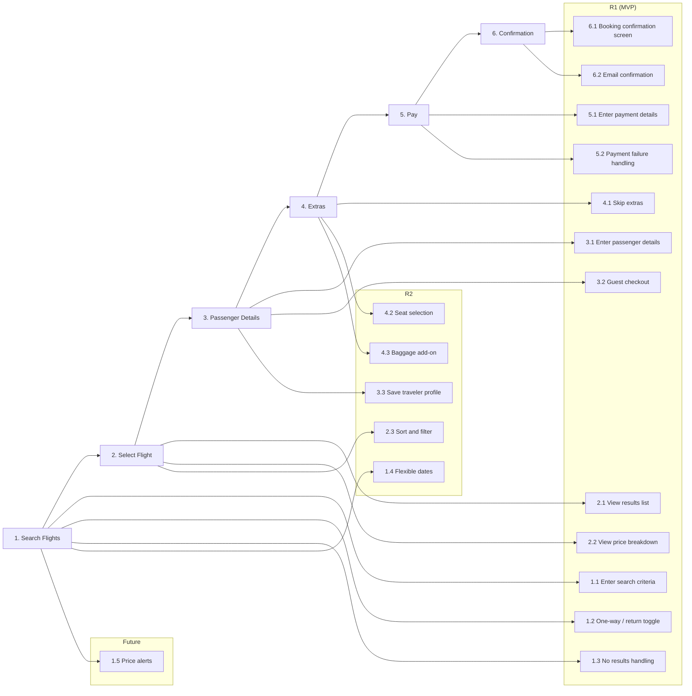

```
USER STORY MAP: Book a Flight
Persona: Leisure Traveler

BACKBONE (User Journey)
═════════════════════════════════════════════════════════════════════════════

┌─────────────┐  ┌─────────────┐  ┌─────────────┐  ┌─────────────┐  ┌─────────────┐  ┌─────────────┐
│  1. Search  │  │  2. Select  │  │  3. Passenger│  │  4. Extras  │  │   5. Pay    │  │  6. Confirm │
│   Flights   │  │   Flight    │  │   Details   │  │             │  │             │  │             │
└──────┬──────┘  └──────┬──────┘  └──────┬──────┘  └──────┬──────┘  └──────┬──────┘  └──────┬──────┘
       │                │                │                │                │                │
───────┼────────────────┼────────────────┼────────────────┼────────────────┼────────────────┼─── R1 (MVP)
       │                │                │                │                │                │
  ┌────┴────┐      ┌────┴────┐      ┌────┴────┐      ┌────┴────┐      ┌────┴────┐      ┌────┴────┐
  │Origin / │      │Results  │      │Passenger│      │Skip /   │      │Enter    │      │Booking  │
  │dest/date│      │list +   │      │name,    │      │continue │      │card     │      │confirm  │
  │pax count│      │price    │      │passport │      │(MVP=skip│      │details  │      │+ ref no │
  └─────────┘      └─────────┘      └─────────┘      │)        │      └─────────┘      └─────────┘
  ┌─────────┐      ┌─────────┐      ┌─────────┐      └─────────┘      ┌─────────┐      ┌─────────┐
  │One-way /│      │Flight   │      │Guest    │                        │Payment  │      │Email    │
  │return   │      │detail   │      │checkout │                        │failure  │      │confirm- │
  │toggle   │      │expand   │      │(no login│                        │handling │      │ation    │
  └─────────┘      └─────────┘      │required)│                        └─────────┘      └─────────┘
  ┌─────────┐      ┌─────────┐      └─────────┘
  │No results│     │Price    │
  │handling │      │breakdown│
  └─────────┘      └─────────┘
       │                │                │                │
───────┼────────────────┼────────────────┼────────────────┼────────────────────────────────────── R2
       │                │                │                │
  ┌────┴────┐      ┌────┴────┐      ┌────┴────┐      ┌────┴────┐
  │Flexible │      │Sort /   │      │Save     │      │Seat     │
  │dates    │      │filter   │      │traveler │      │selection│
  └─────────┘      └─────────┘      │profile  │      └─────────┘
                                    └─────────┘      ┌─────────┐
                                                     │Baggage  │
                                                     │add-on   │
                                                     └─────────┘
───────┼──────────────────────────────────────────────────────────────────── Future
       │
  ┌────┴────┐
  │Price    │
  │alerts   │
  └─────────┘

Legend: 💬 Comment  📝 Task  ⚠️ Risk
```

---

## Story Map: Book a Flight

### Persona
**Primary:** Leisure Traveler — someone booking a personal trip who wants to find and pay for flights quickly with minimal friction. May be a first-time or occasional user. No account required.

---

### Backbone

#### Activity 1: Search Flights
> Traveler enters trip details to find available flights.

##### R1 (MVP)

**Story 1.1: Enter search criteria**
- **User Story:** As a traveler, I want to enter my origin, destination, dates, and passenger count so I can find relevant flights.
- **Acceptance Criteria:**
  - [ ] Given I open the app, then I see origin, destination, departure date, and passenger count fields.
  - [ ] Given all fields are filled, when I tap Search, then results are shown.
- **Tasks:** [ ] Implement search form with airport autocomplete

**Story 1.2: One-way / return toggle**
- **User Story:** As a traveler, I want to choose between a one-way or return trip so I can book the right type of flight.
- **Acceptance Criteria:**
  - [ ] Given I select return, then a return date field appears.
  - [ ] Given I select one-way, then no return date is required.

**Story 1.3: No results handling**
- **User Story:** As a traveler, I want a helpful message when no flights are found so I know what to do next.
- **Acceptance Criteria:**
  - [ ] Given no flights match my search, then I see a clear message and suggestions (adjust dates, nearby airports).
- **Risks:** No-results state is a drop-off risk — must offer recovery options.

##### R2

**Story 1.4: Flexible dates**
- **User Story:** As a traveler, I want to see prices across a range of dates so I can find the cheapest option.
- **Acceptance Criteria:**
  - [ ] Given I enable flexible dates, then I see a calendar view with prices per day.

---

#### Activity 2: Select Flight
> Traveler browses results and picks a flight.

##### R1 (MVP)

**Story 2.1: View results list**
- **User Story:** As a traveler, I want to see a list of available flights with price and duration so I can compare options.
- **Acceptance Criteria:**
  - [ ] Given results load, then each flight shows airline, departure/arrival time, duration, stops, and price.
  - [ ] Given I tap a flight, then I see expanded detail (layovers, aircraft type, baggage policy).

**Story 2.2: View price breakdown**
- **User Story:** As a traveler, I want to see what's included in the price before I commit, so there are no surprises at checkout.
- **Acceptance Criteria:**
  - [ ] Given I expand a flight, then I see a price breakdown (base fare, taxes, fees).
- **Risks:** Hidden fees erode trust — show total price including taxes upfront.

##### R2

**Story 2.3: Sort and filter**
- **User Story:** As a traveler, I want to filter by stops, airline, and price range so I can narrow down results.
- **Acceptance Criteria:**
  - [ ] Given I apply filters, then results update instantly to match my criteria.

---

#### Activity 3: Passenger Details
> Traveler enters passenger information required for the booking.

##### R1 (MVP)

**Story 3.1: Enter passenger details**
- **User Story:** As a traveler, I want to enter passenger names and passport details so my booking is valid.
- **Acceptance Criteria:**
  - [ ] Given I proceed to this step, then I see fields for first name, last name, date of birth, passport number, nationality, and expiry.
  - [ ] Given required fields are missing, then I see inline validation errors before I can proceed.
- **Risks:** Passport validation rules vary by country — must match airline requirements exactly.

**Story 3.2: Guest checkout**
- **User Story:** As a traveler, I want to book without creating an account so I can complete my purchase quickly.
- **Acceptance Criteria:**
  - [ ] Given I reach passenger details, then I am not required to log in or create an account.
  - [ ] Given I provide an email address, then my confirmation is sent there.

##### R2

**Story 3.3: Save traveler profile**
- **User Story:** As a returning traveler, I want my details pre-filled so I don't have to enter them again.
- **Acceptance Criteria:**
  - [ ] Given I am logged in and have a saved profile, then passenger fields are pre-filled.

---

#### Activity 4: Extras
> Traveler optionally adds seats, baggage, or other add-ons.

##### R1 (MVP)

**Story 4.1: Skip extras**
- **User Story:** As a traveler, I want to proceed without selecting any extras so I can complete my booking faster.
- **Acceptance Criteria:**
  - [ ] Given I reach the extras step, then I can skip it with one tap and proceed to payment.
- **Comments:** MVP keeps extras minimal — just a skip option. Full extras in R2.

##### R2

**Story 4.2: Seat selection**
- **User Story:** As a traveler, I want to choose my seat so I can get my preferred position on the plane.
- **Acceptance Criteria:**
  - [ ] Given I open seat selection, then I see a seat map with available and unavailable seats.
  - [ ] Given I select a seat, then the price updates to reflect any seat fee.

**Story 4.3: Baggage add-on**
- **User Story:** As a traveler, I want to add checked baggage to my booking so I don't pay more at the airport.
- **Acceptance Criteria:**
  - [ ] Given I choose a baggage option, then the price updates and baggage is included in my booking.

---

#### Activity 5: Pay
> Traveler enters payment details and confirms the purchase.

##### R1 (MVP)

**Story 5.1: Enter payment details**
- **User Story:** As a traveler, I want to pay by card so I can complete my booking securely.
- **Acceptance Criteria:**
  - [ ] Given I reach payment, then I see a card input form (number, expiry, CVV, name).
  - [ ] Given I submit payment, then I see a loading state while the transaction processes.
  - [ ] Given payment succeeds, then I am taken to the confirmation screen.
- **Risks:** PCI compliance — card details must never touch our servers. Use a payment provider (Stripe, Adyen).

**Story 5.2: Payment failure handling**
- **User Story:** As a traveler, I want a clear message if my payment fails so I know what to do next.
- **Acceptance Criteria:**
  - [ ] Given payment is declined, then I see a specific reason (card declined, insufficient funds) and can retry.
  - [ ] Given a network error occurs, then my booking is not duplicated and I can safely retry.
- **Risks:** Double-charge risk on network timeout — must implement idempotency on payment requests.

---

#### Activity 6: Confirmation
> Traveler receives confirmation of their booking.

##### R1 (MVP)

**Story 6.1: Booking confirmation screen**
- **User Story:** As a traveler, I want to see my booking reference and full details immediately after payment so I know my booking is confirmed.
- **Acceptance Criteria:**
  - [ ] Given payment succeeds, then I see my booking reference, flight details, passenger names, and total paid.

**Story 6.2: Email confirmation**
- **User Story:** As a traveler, I want to receive a confirmation email so I have a record of my booking.
- **Acceptance Criteria:**
  - [ ] Given booking is confirmed, then an email is sent within 2 minutes to the address provided.
  - [ ] Given the email is received, then it contains booking reference, flight details, and a link to manage the booking.
- **Tasks:** [ ] Design and implement confirmation email template

---

### Release Summary

| Release | Scope | Stories | Goal |
|---------|-------|---------|------|
| R1 (MVP) | Core booking flow | 1.1, 1.2, 1.3, 2.1, 2.2, 3.1, 3.2, 4.1, 5.1, 5.2, 6.1, 6.2 | Traveler can search, select, enter details, and pay for a flight as a guest |
| R2 | Enhanced UX | 1.4, 2.3, 3.3, 4.2, 4.3 | Flexible dates, filters, seat/baggage selection, saved profiles |
| Future | Price intelligence | 1.5 | Price alerts for saved routes |

---

### Open Risks

| ID | Story | Risk | Severity | Status |
|----|-------|------|----------|--------|
| R1 | 5.1 | PCI compliance — use Stripe/Adyen, never store raw card data | High | Open |
| R2 | 5.2 | Double-charge on timeout — implement idempotency on payment API | High | Open |
| R3 | 3.1 | Passport validation rules vary by route/airline | Medium | Open |
| R4 | 1.3 | No-results state is a drop-off risk — must offer recovery options | Medium | Open |
| R5 | 2.2 | Hidden fees erode trust — show total price including taxes upfront | Medium | Open |

### Open Tasks

| ID | Story | Task | Owner | Status |
|----|-------|------|-------|--------|
| T1 | 1.1 | Implement airport autocomplete (IATA codes) | — | Todo |
| T2 | 3.1 | Define passport validation rules per airline/route | — | Todo |
| T3 | 5.1 | Integrate payment provider (Stripe / Adyen) | — | Todo |
| T4 | 6.2 | Design and implement confirmation email template | — | Todo |

---

### Mermaid Diagram


