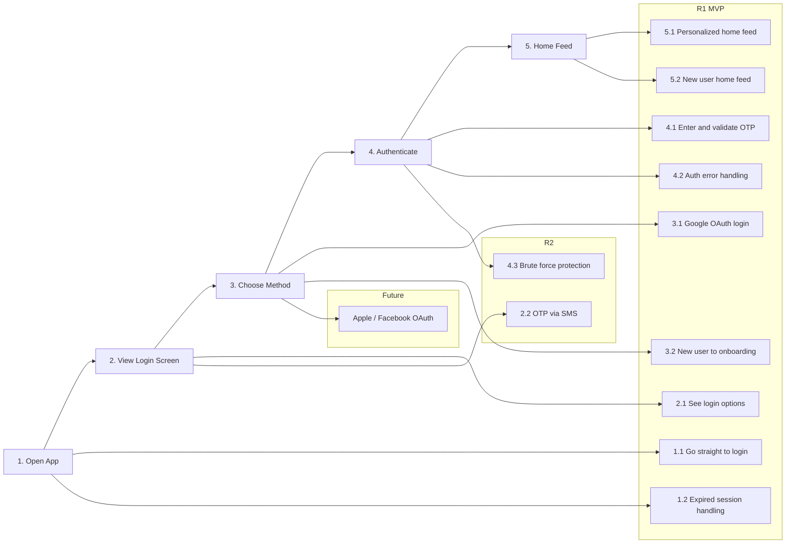

```
USER STORY MAP: User Login
Persona: Finnish Consumer (buyer/seller)

BACKBONE (User Journey)
═════════════════════════════════════════════════════════════════════════════

┌─────────────┐  ┌─────────────┐  ┌─────────────┐  ┌─────────────┐  ┌─────────────┐
│  1. Open    │  │  2. View    │  │  3. Choose  │  │  4. Authen- │  │  5. Home    │
│     App     │  │   Login     │  │   Method    │  │   ticate    │  │    Feed     │
└──────┬──────┘  └──────┬──────┘  └──────┬──────┘  └──────┬──────┘  └──────┬──────┘
       │                │                │                │                │
───────┼────────────────┼────────────────┼────────────────┼────────────────┼─── R1 (MVP)
       │                │                │                │                │
  ┌────┴────┐      ┌────┴────┐      ┌────┴────┐      ┌────┴────┐      ┌────┴────┐
  │Straight │      │Google + │      │Google   │      │OTP: 10m │      │New user │
  │to login │      │OTP email│      │OAuth    │      │3 attempt│      │feed     │
  └─────────┘      └─────────┘      └─────────┘      │resend   │      └─────────┘
  ┌─────────┐      ┌─────────┐      ┌─────────┐      └─────────┘      ┌─────────┐
  │Session  │      │OTP email│      │New user │      ┌─────────┐      │Popular  │
  │10d token│      │templates│      │→ onboard│      │Error msg│      │listings │
  │⚠️ expiry │      │⚠️ delivry│      │💬 TBD   │      │📝 copy  │      │+ CTA    │
  └─────────┘      └─────────┘      └─────────┘      └─────────┘      └─────────┘
  ┌─────────┐      ┌─────────┐
  │Configur-│      │📝 FI/SV/│
  │able     │      │EN local-│
  │persist. │      │ization  │
  └─────────┘      └─────────┘
       │                │
───────┼────────────────┼────────────────────────────────────────────────────── R2
       │                │
  ┌────┴────┐      ┌────┴────┐
  │Brute    │      │OTP via  │
  │force    │      │SMS      │
  │lockout  │      └─────────┘
  └─────────┘
───────┼──────────────────────────────────────────────────────────────────── Future
       │
  ┌────┴────┐
  │Apple /  │
  │Facebook │
  │OAuth    │
  └─────────┘

Legend: 💬 Comment  📝 Task  ⚠️ Risk
```

---

## Story Map: User Login

### Persona
**Primary:** Finnish Consumer — a buyer and/or seller of used sports gear who needs quick, secure access to the marketplace. Expects the app to work seamlessly in Finnish, Swedish, or English.

---

### Backbone

#### Activity 1: Open App
> User opens the app and is taken directly to the login screen — no splash screen or onboarding gate.

##### R1 (MVP)

**Story 1.1: Go straight to login**
- **User Story:** As a consumer, I want to land on the login screen immediately when I open the app, so I can get in without unnecessary steps.
- **Acceptance Criteria:**
  - [ ] Given the app is opened, when the user has no active session, then the login screen is shown immediately.
  - [ ] Given the app is opened, when the user has an active session, then they are taken directly to the home feed.

**Story 1.2: Expired session handling**
- **User Story:** As a consumer, I want to be redirected to login gracefully when my session expires, so I don't lose context.
- **Acceptance Criteria:**
  - [ ] Given a session has expired, when the user opens the app, then they see the login screen with a clear message that their session ended.
  - [ ] Given a session expires mid-browse, when the user tries to act, then they are redirected to login and returned to where they were after re-authenticating.
- **Tasks:**
  - [ ] Implement 10-day token persistence (default)
  - [ ] Implement session-only option (no persistence) — user-configurable in settings
- **Risks:** Expired token mid-session must redirect gracefully without losing the user's context (e.g., the listing they were viewing).

---

#### Activity 2: View Login Screen
> User sees the login screen with available authentication options.

##### R1 (MVP)

**Story 2.1: See login options**
- **User Story:** As a consumer, I want to see clear login options so I can choose the method that suits me.
- **Acceptance Criteria:**
  - [ ] Given I open the login screen, then I see "Continue with Google" and "Continue with email (OTP)" options.
  - [ ] Given I am on the login screen, then all copy is displayed in my preferred language (Finnish, Swedish, or English).
- **Tasks:**
  - [ ] Design login screen UI (Google button + email input)
  - [ ] Implement language detection / selection (FI / SV / EN)
  - [ ] Create OTP email templates in all 3 languages
- **Risks:** Email deliverability — OTP codes must arrive quickly. Use a reliable provider (SendGrid, Postmark, etc.). Test Finnish and Swedish email rendering.

##### R2

**Story 2.2: OTP via SMS**
- **User Story:** As a consumer, I want to receive my login code via SMS so I can log in without access to my email.
- **Acceptance Criteria:**
  - [ ] Given I choose SMS, when I enter my Finnish/Swedish phone number, then I receive a valid OTP within 30 seconds.
- **Tasks:**
  - [ ] Integrate SMS provider with Finnish/Swedish number support
- **Risks:** SMS costs per message, carrier routing complexity for Finnish numbers.
- **Comments:** Deferred from MVP — email OTP covers most users at launch.

---

#### Activity 3: Choose Login Method
> User selects Google OAuth or enters their email for OTP.

##### R1 (MVP)

**Story 3.1: Google OAuth login**
- **User Story:** As a consumer, I want to log in with my Google account so I don't need to manage a separate login.
- **Acceptance Criteria:**
  - [ ] Given I tap "Continue with Google", then I am taken through the standard Google OAuth flow.
  - [ ] Given I successfully authenticate with Google, then I am taken to the home feed (or onboarding if first time).

**Story 3.2: New user → account creation**
- **User Story:** As a new consumer, I want to be guided through setting up my account after my first login so I can start buying and selling.
- **Acceptance Criteria:**
  - [ ] Given it is my first login (Google or OTP), then I am directed to the account creation flow before the home feed.
  - [ ] Given I have already completed onboarding, then I am taken directly to the home feed.
- **Comments:** Account creation flow (terms acceptance, profile info) is defined in a separate map (TBD).

---

#### Activity 4: Authenticate
> User completes the authentication — enters OTP code or finishes Google OAuth.

##### R1 (MVP)

**Story 4.1: Enter and validate OTP**
- **User Story:** As a consumer, I want to enter my OTP code and be logged in instantly, so I can access the app without friction.
- **Acceptance Criteria:**
  - [ ] Given I receive an OTP, when I enter it within 10 minutes, then I am logged in successfully.
  - [ ] Given I enter a wrong code, then I see a clear error with attempts remaining.
  - [ ] Given I exhaust 3 attempts, then I am locked out and shown how to request a new code.
  - [ ] Given the code has expired, then I see a clear message and a resend option.
- **Tasks:**
  - [ ] OTP: 10-minute expiry, 3-attempt limit, resend option
  - [ ] Write error message copy for all failure states in FI / SV / EN

**Story 4.2: Authentication error handling**
- **User Story:** As a consumer, I want clear error messages when login fails so I know exactly what went wrong and what to do next.
- **Acceptance Criteria:**
  - [ ] Given any auth failure (wrong code, expired, Google error, network), then I see a specific, actionable error message in my language.
- **Risks:** Localization — all error states must be translated in Finnish, Swedish, and English.

##### R2

**Story 4.3: Brute force protection**
- **User Story:** As the platform, I need to prevent automated login attempts so user accounts stay secure.
- **Acceptance Criteria:**
  - [ ] Given 3 failed OTP attempts, when a user tries again, then they face a cooldown or CAPTCHA before a new code can be requested.
- **Risks:** Too aggressive lockout frustrates legitimate users; too lenient allows abuse.

---

#### Activity 5: Land on Home Feed
> User reaches their personalized dashboard after successful login.

##### R1 (MVP)

**Story 5.1: Personalized home feed**
- **User Story:** As a returning consumer, I want to see my personalized dashboard so I can pick up where I left off.
- **Acceptance Criteria:**
  - [ ] Given I am a returning user, then I see my active sales, followed items, and personalized suggestions.

**Story 5.2: New user home feed**
- **User Story:** As a new consumer, I want to see relevant content immediately so the app feels useful from day one.
- **Acceptance Criteria:**
  - [ ] Given it is my first session after onboarding, then I see popular listings, onboarding tips, and a "Start your first sale" CTA.
  - [ ] Given I have no purchase or sale history, then no empty states are shown.

---

### Release Summary

| Release | Scope | Stories | Goal |
|---------|-------|---------|------|
| R1 (MVP) | Core login flow | 1.1, 1.2, 2.1, 3.1, 3.2, 4.1, 4.2, 5.1, 5.2 | Users can log in with Google or email OTP, new users are onboarded, returning users reach their personalized feed |
| R2 | Enhanced auth | 2.2, 4.3 | SMS OTP support, brute force protection |
| Future | Additional OAuth | — | Apple, Facebook login |

---

### Open Risks

| ID | Story | Risk | Severity | Status |
|----|-------|------|----------|--------|
| R1 | 2.1 | Email deliverability for OTP — needs reliable provider | High | Open |
| R2 | 1.2 | Expired session mid-browse must redirect without losing context | Medium | Open |
| R3 | 4.2 | All error messages must be localized in FI / SV / EN | Medium | Open |
| R4 | 2.2 | SMS carrier routing for Finnish/Swedish numbers | Medium | Open |
| R5 | 4.3 | Brute force lockout balance — security vs. user frustration | Medium | Open |

### Open Tasks

| ID | Story | Task | Owner | Status |
|----|-------|------|-------|--------|
| T1 | 1.2 | Implement 10-day token + session-only persistence, user-configurable | — | Todo |
| T2 | 2.1 | Design login screen UI | — | Todo |
| T3 | 2.1 | Create OTP email templates in FI / SV / EN | — | Todo |
| T4 | 2.1 | Integrate email provider (SendGrid / Postmark) | — | Todo |
| T5 | 4.1 | OTP logic: 10-min expiry, 3 attempts, resend | — | Todo |
| T6 | 4.2 | Write all error message copy in FI / SV / EN | — | Todo |
| T7 | 2.2 | Integrate SMS provider for Finnish/Swedish numbers (R2) | — | Todo |

---

### Mermaid Diagram


